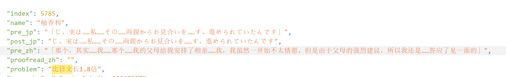

| 模型       | claude-3-haiku-20240307                |
| :--------- | :------------------------------------- |
| 连接可用性 | 无需科学上网即可使用（ip北京、校园网） |
| 用时       | 9400 s                                 |
| 文本量     | 321468（日文）（大约每小时12w文本）    |
| 费用       | 2.25刀（10w文本0.7刀）                 |
| 和谐情况   | 并没有出现和谐                         |

### 配置详情：

工具：galtransl

配置了字典（仅包含人名）

每次输入8行

### 翻译效果：

效果一般，部分语句不太通顺，随便翻了翻，有点不说人话，而且还容易加戏（过度联系上下文）；但是性价比很不错。

相比Sakura13b，目前体感不如sakura，但是不会像sakura那样人称代词乱用。

感觉haiku就适合翻点小拔作，需要认真看剧情的还是不太行。之后我拿其他作品试试更好的模型。

