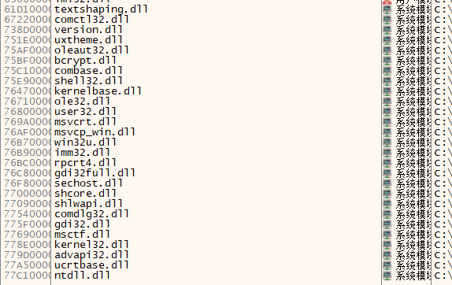

本机翻补丁由jyxjyx1234@github制作，使用claude-3-haiku，仅供交流学习，请在购买正版游戏本体的基础上使用本补丁。

2dfan主页：[https://2dfan.com/users/290175](https://2dfan.com/users/290175)
github主页：[https://github.com/jyxjyx1234](https://github.com/jyxjyx1234)

## 使用说明

从dlls文件夹中选择一个dll放入游戏目录下，然后将本补丁中其他文件也放入游戏目录下即可。

需要安装游戏更新补丁。

游戏启动时需要插入GIMAISOUNDDISK。

需要转区运行。

需要在游戏设置中将ポイスシンクロ设为off（オフ）。

在hook.ini中可以调节字体。（FONTHEIGHT：大小，FONTWEIGHT：粗细）。

## 已知问题

部分文本显示会不全，少量地方存在显示错误。

## 看不到译文？

可以按照以下步骤进行处理并反馈：

- 先依次尝试所给的几个dll
- 将hook.ini文件中的DEBUG这一项改为1
- 依次尝试将dll更名为下图中所示意的名称，然后启动游戏，如果游戏运行时出现了命令行窗口，将这个dll的名称反馈给我，我会发布新的补丁。

