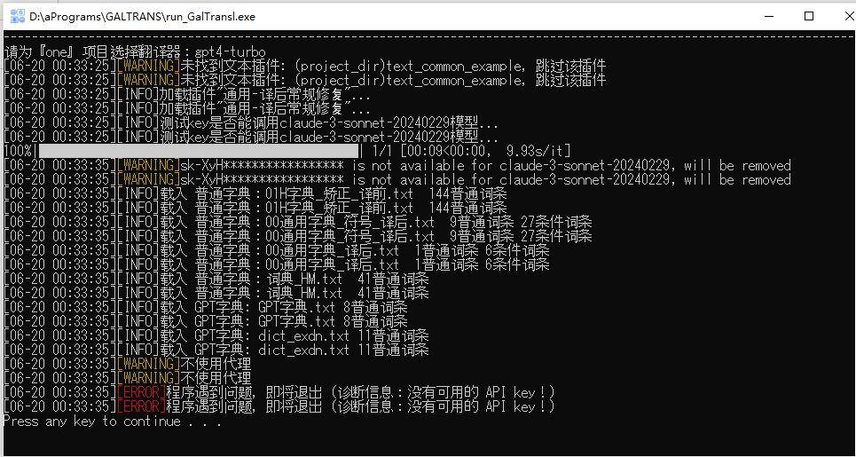

| 模型   | claude-3-sonnet-20240229     |
| ------ | ---------------------------- |
| 文本量 | 164526                       |
| 用时   | 无法统计，中间报错中断太多了 |
| 费用   | 10.5                         |

连接状况：十分不稳定。大概用十来分钟就挂，再等个十来分钟才好。中途也时不时会报401、403.

以及，galtransl的测试模块跟这个模型的兼容性不是很好，启动galtranl时显示测试模型失败，但是网站上显示收到了请求。所以我进行了魔改，把galtansl的测试模块屏蔽了。

翻译效果：粗略看了一下，相当的不错，比haiku要好得多，相比sakura也有提升。
