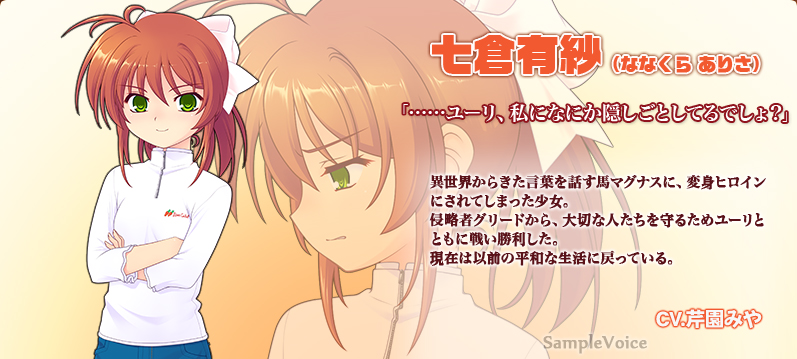
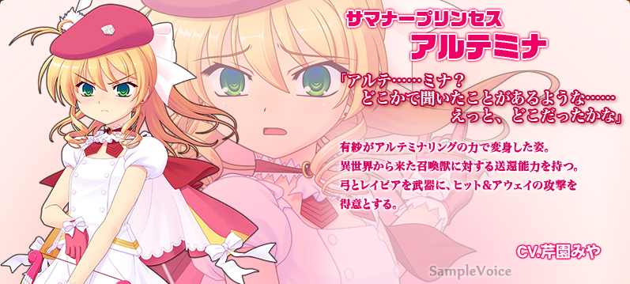
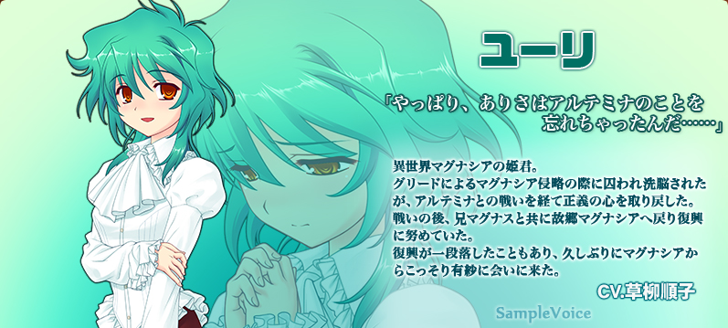
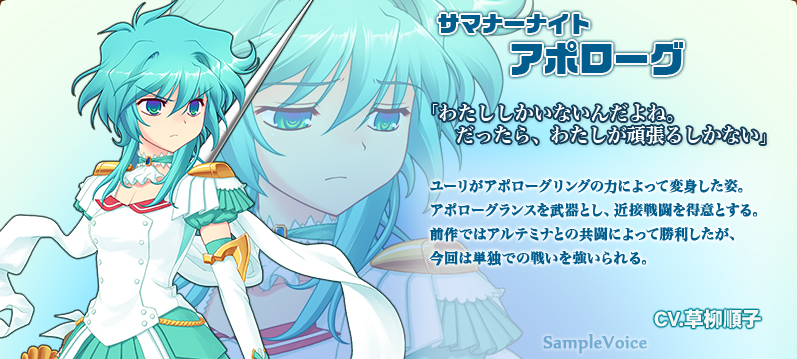
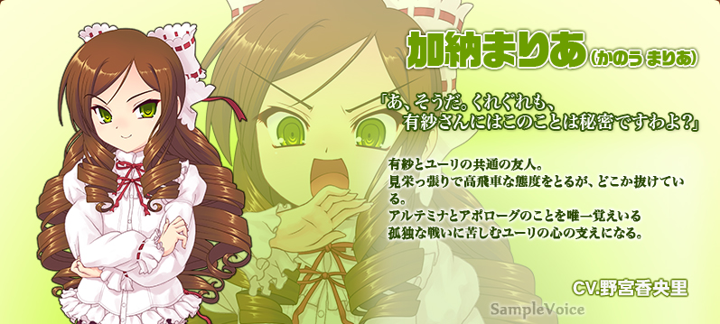
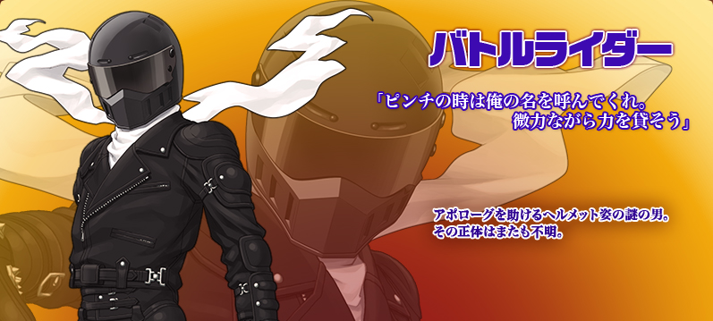
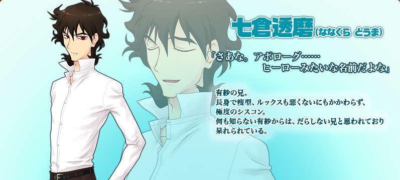
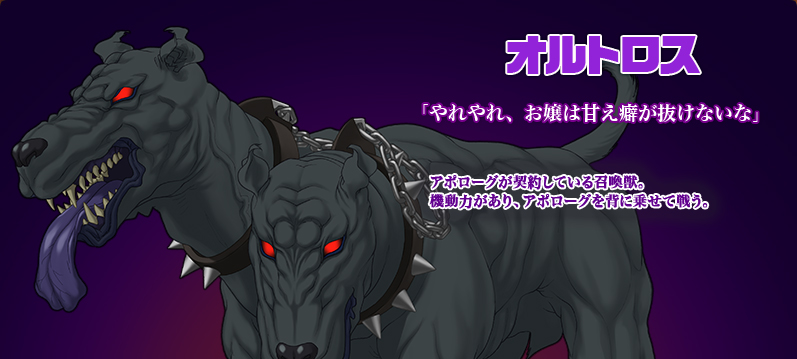
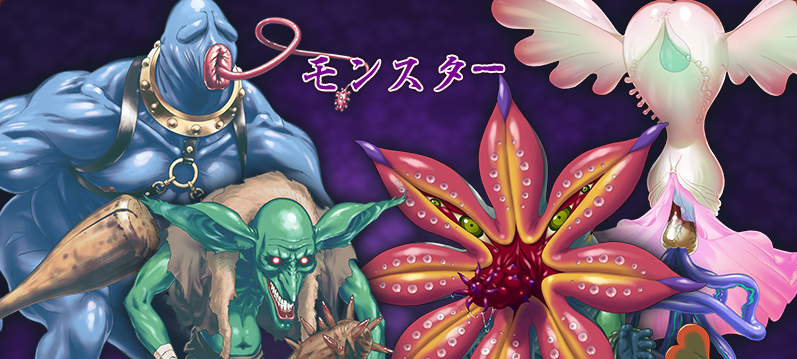
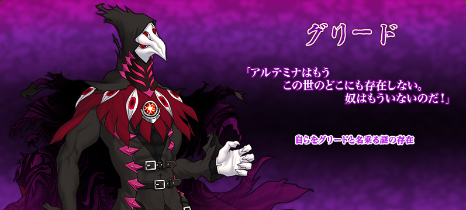

久违地来到有纱身边的尤莉（ユーリ），等待着她的是自称为格里德（グリード）的神秘男子。

尤莉变身为阿普洛古（アポローグ）与之战斗，但战败后被格里德带走。

阿普洛古遭受了极限的凌辱。

虽然她们被奥特罗斯（オルトロス）救了出来，但这座城市的人们已经忘记了阿尔忒米娜（アルテミナ）和格里德。

连有纱都忘记了阿尔忒米娜的事，而格里德的恶魔之手正在逼近。

尤莉开始了与格里德的孤军奋战 ...

#### 人物介绍：

（部分摘抄的第一部的介绍）

##### 七倉 有紗 （ななくら ありさ）　CV：芹園みや

被来自异世界的马——玛格纳斯（マグナス）变成魔法少女的女孩。

她与尤莉一起战斗，保护她珍贵的朋友们免受入侵者格里德的伤害，并取得了战斗的胜利。

 现在，她又回到了以前平静的生活。

「尤莉，你有什么事瞒着我吧？」

##### 阿尔忒米娜（アルテミナ）　CV：芹園みや

有纱以阿尔忒米娜指环之力变身的样子。

拥有对来自异世界的召唤兽送还的能力。

以弓和刺突剑为武器，擅长远距离战斗。

「阿尔忒……米娜，好像在哪里听说过，是在哪里呢？」

##### 尤莉（ユーリ）　CV：草柳順子

异世界·玛古那西亚的公主。
在格里德侵略玛古那西亚时被囚禁并被洗脑，但经过与阿尔忒米娜的战斗，恢复了正义之心。
战斗后，与哥哥玛格纳斯一起回到故乡玛古那西亚，为复兴而努力。

复兴告一段落，久违地从玛古那西亚悄悄地来见有纱。

「果然，有纱把阿尔忒米娜的事给忘了……」

##### 阿普洛古（アポローグ）　CV：草柳順子

尤莉在阿普洛古指环之力下变身的样子。

以长枪为武器，擅长近战。

在前作中与阿尔忒米娜共同战斗而获胜，但这次被迫独自战斗。

「我是唯一一个。只能硬着头皮上了。」

##### 加納 まりあ （かのう まりあ）　CV：野宮香央里

有纱和尤莉共同的朋友。

虽然采取了虚荣、傲慢的态度，但总觉得又不是。

她是唯一一个还记得阿尔忒弥娜和阿普洛古的人，是孤独作战的尤莉的心灵支柱。

「啊，对了。这件事千万不能告诉有纱小姐哦？」

##### 战斗骑士（バトルライダー）

帮助阿尔忒米娜的神秘男子。
原形不明。

「遇到危机时就呼唤我的名字吧。虽然力量微薄，但我会助你一臂之力。」

##### 七倉 透磨 （ななくら とうま）

有纱的哥哥。
高个子瘦型，容貌也不错，但极度的妹控。
给有纱一股不检点和呆板的印象。

「阿普洛古……这个名字听起来很像英雄啊。」

##### 奥特罗斯（オルトロス）

与阿普洛古契约的召唤兽。

机动力强，阿普洛古骑在它背上。

「哎呀，大小姐可真会撒娇。」

##### 怪物们

##### 格里德（グリード）

自称格里德的谜之存在。

「阿尔忒米娜已经不在这个世界上任何地方了。她已经不在了！」
