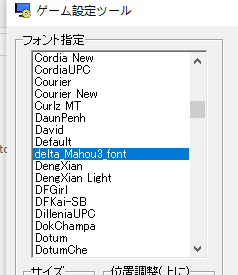
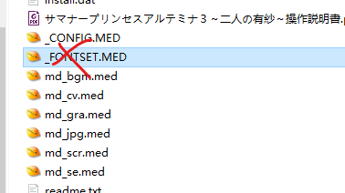

本机翻补丁由jyxjyx1234@github制作，使用sakura-14b-qwen2beta-v0.9.2-q4km，仅供交流学习，请在购买正版游戏本体的基础上使用本补丁。

2dfan主页：[https://2dfan.com/users/290175](https://2dfan.com/users/290175)
github主页：[https://github.com/jyxjyx1234](https://github.com/jyxjyx1234)

## 使用说明：

有两个版本：简中和繁中（tra），自行选择。

将补丁中的exe文件复制到游戏的安装目录。安装对应版本的字体，在"setting.exe"中将字体选定为delta_Mahou3_font，删除_FONTSET.MED文件（如果有），然后点击补丁的exe文件运行游戏。每次更换补丁版本时需要重复上述操作。（我修改了字体的名称，所以应该不会造成问题，但是之后最好记得把字体卸载掉。理论上安装、选择字体并启动一次游戏后字体就会缓存在_FONTSET.MED文件中，此时就可以卸载字体了。）

本补丁基于光盘版制作，没有在dl版进行测试。欢迎留言反馈dl版测试的结果。

如果生肉能够运行，但使用汉化补丁后不能运行，请将生肉的exe提供给我。
